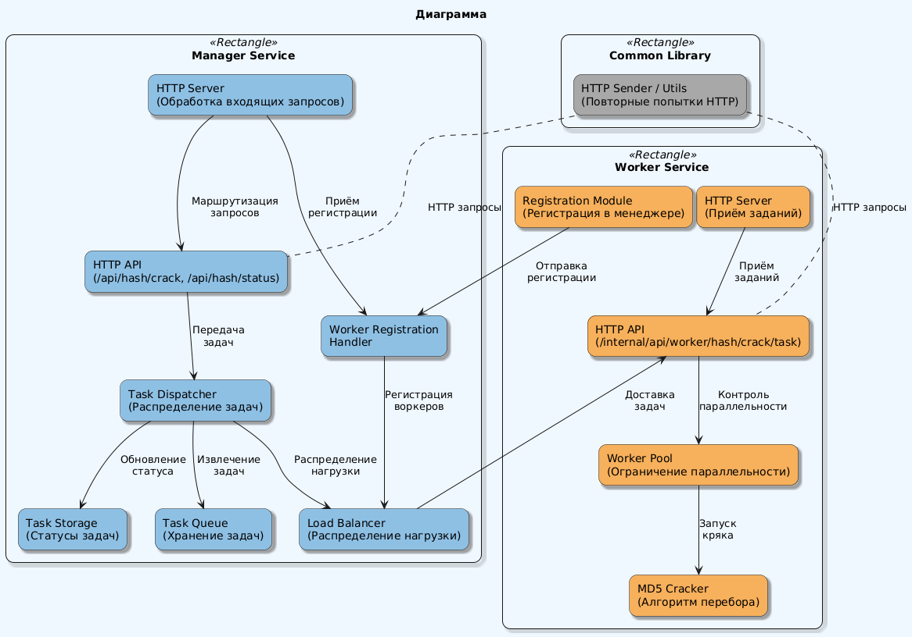
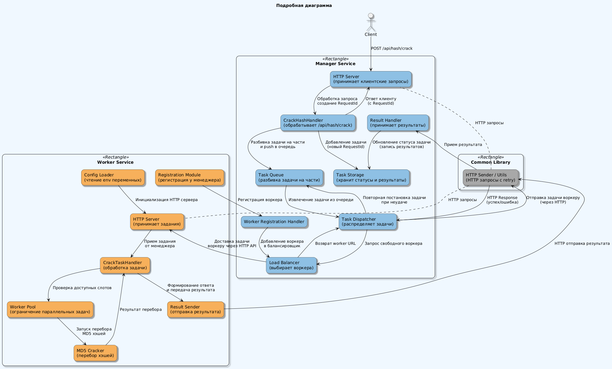

# Распределенная информационная система по расшифровке MD5 хэша

# Содержание

1. [Описание проекта](#описание-проекта)
2. [Запуск проекта](#запуск-проекта)
3. [Тестирование системы](#тестирование-системы)
   - [Доступные команды](#доступные-команды)
   - [Пример использования](#пример-использования)
4. [API Endpoints](#api-endpoints)
   - [Manager Public API](#manager-public-api)
   - [Manager Internal API](#manager-internal-api)
   - [Worker API](#worker-api)
5. [Структура проекта](#структура-проекта)
6. [Диаграммы](#диаграммы)
   - [High-Level Overview](#high-level-overview)
   - [Detailed Architecture](#detailed-architecture)
7. [Проблемы текущей реализации](#проблемы-текущей-реализации)

## Описание проекта

Система представляет собой распределённое приложение для подбора исходных строк по их MD5-хэшам методом перебора *(bruteforce)*. Состоит из двух основных компонентов:
- Manager: координирует работу, распределяет задачи и обрабатывает запросы клиентов
- Worker: выполняет непосредственный перебор и поиск совпадений хэшей

## Запуск проекта

```bash
docker compose up --build -d
```

## Тестирование системы

Для тестирования используйте утилиту из [директории test](test):

```bash
cd test
go run main.go
```

Доступные команды:

1. Получить MD5 хэш строки:
```bash
go run main.go -md5 "test"
```

2. Отправить задачу на расшифровку хэша:
```bash
go run main.go -crack <hash> [maxLength]
```
Пример:
```bash
go run main.go -crack 098f6bcd4621d373cade4e832627b4f6 4
```

3. Проверить статус расшифровки:
```bash
go run main.go -status <requestId>
```

### Пример использования

```bash
# Получаем хэш строки "test"
go run main.go -md5 "test"
# Вывод: 098f6bcd4621d373cade4e832627b4f6

# Отправляем задачу на расшифровку
go run main.go -crack 098f6bcd4621d373cade4e832627b4f6 4
# Вывод: RequestId: <some-uuid>

# Проверяем статус расшифровки
go run main.go -status <requestId>
```

## API Endpoints

### Manager Public API

#### POST /api/hash/crack
Отправляет запрос на расшифровку хэша.

Request:
```json
{
    "hash": "098f6bcd4621d373cade4e832627b4f6",
    "maxLength": 4
}
```

Response:
```json
{
    "requestId": "550e8400-e29b-41d4-a716-446655440000"
}
```

#### GET /api/hash/status?requestId={requestId}
Получает статус расшифровки по requestId.

Response:
```json
{
    "status": "DONE|IN_PROGRESS|FAIL",
    "data": ["найденная_строка"]
}
```

### Manager Internal API

#### POST /internal/api/manager/hash/crack/result
Внутренний endpoint для получения результатов от worker'ов.

Request:
```json
{
    "hash": "098f6bcd4621d373cade4e832627b4f6",
    "result": "test",
    "partNumber": 1
}
```

#### POST /internal/api/worker/register
Endpoint для регистрации новых worker'ов в системе.

Request:
```json
{
    "workerUrl": "http://worker:8081",
    "maxWorkers": 4
}
```

### Worker API

#### POST /internal/api/worker/hash/crack/task
Endpoint для получения заданий на расшифровку от manager'а.

Request:
```json
{
    "hash": "098f6bcd4621d373cade4e832627b4f6",
    "maxLength": 4,
    "partNumber": 1,
    "partCount": 8
}
```

## Структура проекта

```
lab1/
├── common/
│   └── utils/
│       └── http_sender.go        # Общие утилиты для отправки HTTP‑запросов с ретраями,
│                                 # используемые как менеджером, так и воркером.
├── manager/
│   ├── cmd/
│   │   └── manager/
│   │       └── main.go           # Точка входа менеджера. Здесь инициализируются все компоненты:
│   │                                 глобальное хранилище, балансировщик, диспетчер и сервер.
│   ├── balancer/
│   │   └── round_robin.go        # Реализация балансировщика (Round Robin) для распределения
│   │                                 задач между воркерами с учетом их загрузки.
│   ├── dispatcher/
│   │   └── task_dispatcher.go    # Диспетчер, который забирает задачи из очереди и отправляет их
│   │                                 воркерам, используя балансировщик.
│   ├── handlers/
│   │   ├── crack_hash_handler.go # HTTP‑обработчик для получения запроса на взлом хэша.
│   │   ├── result_handler.go     # Обработчик для приема результатов от воркеров.
│   │   ├── status_handler.go     # Обработчик для получения статуса задачи по requestId.
│   │   └── worker_handler.go     # Обработчик регистрации воркеров в системе.
│   ├── models/
│   │   ├── crack_task.go         # Модели для задания на перебор хэша и результатов.
│   │   ├── hash.go               # Модели запросов/ответов от клиентов (HashCrackRequest/Response).
│   │   ├── status.go             # Модель для статуса задачи (например, IN_PROGRESS, DONE, FAIL).
│   │   └── task_storage.go       # Структуры для хранения состояния задач (in‑memory).
│   ├── queue/
│   │   └── task_queue.go         # Реализация очереди задач для диспетчера (in‑memory очередь).
│   ├── store/
│   │   └── task_storage.go       # Глобальное хранилище (wrapper над models.TaskStorage)
│   ├── server/
│   │   └── server.go             # Инициализация HTTP‑сервера, регистрация маршрутов и запуск ListenAndServe.
│   └── go.mod                    # Файл модуля менеджера.
├── worker/
│   ├── cmd/
│   │   └── worker/
│   │       └── main.go           # Точка входа воркера. Здесь происходит загрузка конфигурации,
│   │                                 регистрация у менеджера и запуск HTTP‑сервера.
│   ├── config/
│   │   └── config.go             # Загрузка конфигурационных параметров (например, MAX_WORKERS,
│   │                                 WORKER_URL, MANAGER_URL) из переменных окружения.
│   ├── cracker/
│   │   ├── cracker.go            # Интерфейс Cracker для реализации алгоритмов перебора хэшей.
│   │   └── md5cracker.go         # Конкретная реализация Cracker для MD5 (перебор по алфавиту a-z0-9).
│   ├── handlers/
│   │   └── crack_handler.go      # HTTP‑обработчик, получающий задания на перебор от менеджера.
│   ├── models/
│   │   └── task.go               # Модели для задачи перебора (запрос и результат), используемые воркером.
│   ├── pool/
│   │   └── workerpool.go         # Пул воркеров для ограничения числа параллельных задач.
│   ├── registration/
│   │   └── registration.go       # Логика регистрации воркера в менеджере.
│   └── go.mod                    # Файл модуля воркера.
├── docker-compose.yml            # Компоновка контейнеров (менеджер и несколько воркеров).
├── Dockerfile.manager            # Dockerfile для сборки образа менеджера.
└── Dockerfile.worker             # Dockerfile для сборки образа воркера.
```

## Диаграммы

### High-Level Overview
На этой диаграмме кратко показаны основные компоненты и их взаимодействие.
  


### Detailed Architecture
На этой диаграмме представлен полный обзор всех компонентов, потоков и обмена данными от запроса клиента до хранения результатов.



## Проблемы текущей реализации

1. **Отсутствие персистентности данных**
   - Все данные хранятся только в оперативной памяти менеджера
   - При падении менеджера теряются все активные задачи и их результаты
   - Нет возможности восстановить состояние системы после сбоя

2. **Ненадежная коммуникация** *(UPD: в новой реализации менеджер по Round Robin отправляет рабочим воркерам задания, а еще в случае неуспешной отправки выполняется ретрай отправки)*
   - Прямое HTTP взаимодействие между компонентами без промежуточного слоя
   - При недоступности менеджера ответы от воркеров теряются
   - При недоступности воркера задача не может быть переназначена

3. **Отсутствие масштабируемости** *(UPD: в новой реализации у менеджера есть массив URL воркеров (при этом воркеры регистрируются самостоятельно), с распределением по Round Robin)*
   - Система работает только с одним воркером
   - Нет механизма балансировки нагрузки
   - Отсутствует возможность горизонтального масштабирования

4. **Отсутствие отказоустойчивости**
   - Нет реплицирования данных
   - Единая точка отказа в виде менеджера
   - Отсутствует механизм перезапуска и восстановления компонентов

*UPD: в обновленной реализации нарушаются только 1 и 4 пункты*
