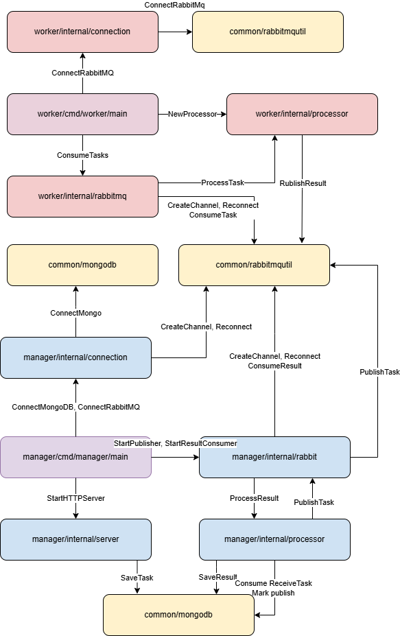

# Отказоустойчивая распределенная система для расшифровки MD5 хэшей

# Содержание

1. [Описание проекта](#описание-проекта)
2. [Архитектурные улучшения](#архитектурные-улучшения)
3. [Компоненты системы](#компоненты-системы)
4. [Запуск проекта](#запуск-проекта)
5. [Тестирование системы](#тестирование-системы)
   - [Доступные команды](#доступные-команды)
   - [Пример использования](#пример-использования)
6. [API Endpoints](#api-endpoints)
   - [Manager Public API](#manager-public-api)
7. [Структура проекта](#структура-проекта)
8. [Диаграммы](#диаграммы)
   - [Полная архитектура](#полная-архитектура)
   - [Компоненты и взаимодействия](#компоненты-и-взаимодействия)
9. [Решенные проблемы](#решенные-проблемы)

## Описание проекта

Система представляет собой отказоустойчивую распределённую систему для подбора исходных строк по их MD5-хэшам методом перебора *(bruteforce)*. Особенностью данной реализации является поддержка отказоустойчивости и масштабируемости. Система состоит из следующих основных компонентов:
- **Manager**: координирует работу, распределяет задачи и обрабатывает запросы клиентов
- **Workers**: выполняют непосредственный перебор и поиск совпадений хэшей
- **RabbitMQ**: обеспечивает надежную коммуникацию между компонентами
- **MongoDB**: обеспечивает персистентное хранение данных с репликацией

## Архитектурные улучшения

Данная версия системы устраняет следующие проблемы предыдущей реализации:

1. **Персистентность данных**
   - Использование MongoDB с репликацией для хранения всех задач и результатов
   - Возможность восстановления состояния системы после сбоев

2. **Надежная асинхронная коммуникация**
   - Использование RabbitMQ для очередей сообщений между компонентами
   - Гарантированная доставка задач воркерам и результатов менеджеру
   - Автоматические повторные попытки в случае сбоев

3. **Масштабируемость**
   - Возможность горизонтального масштабирования воркеров
   - Балансировка нагрузки через RabbitMQ

4. **Отказоустойчивость**
   - Репликация данных в MongoDB
   - Обработка отключений RabbitMQ и автоматическое переподключение
   - Механизмы повторных попыток выполнения операций

## Компоненты системы

### Manager
- Обрабатывает HTTP-запросы от клиентов
- Хранит задачи в MongoDB
- Публикует подзадачи в очередь "tasks" RabbitMQ
- Потребляет результаты из очереди "results" RabbitMQ

### Worker
- Потребляет подзадачи из очереди "tasks"
- Выполняет перебор MD5 хэшей
- Публикует результаты в очередь "results"

### RabbitMQ
- Обеспечивает надежную асинхронную коммуникацию между компонентами
- Две очереди: "tasks" и "results"

### MongoDB
- Репликация для обеспечения отказоустойчивости
- Хранение информации о задачах и результатах

## Запуск проекта

```bash
docker compose up --build -d
```

## Тестирование системы

Для тестирования используйте утилиту из [директории test](test):

```bash
cd test
go run main.go
```

### Доступные команды

1. Получить MD5 хэш строки:
```bash
go run main.go -md5 "test"
```

2. Отправить задачу на расшифровку хэша:
```bash
go run main.go -crack <hash> <maxLength>
```
Пример:
```bash
go run main.go -crack 098f6bcd4621d373cade4e832627b4f6 4
```

3. Проверить статус расшифровки:
```bash
go run main.go -status <requestId>
```

### Пример использования

```bash
# Получаем хэш строки "test"
go run main.go -md5 "test"
# Вывод: 098f6bcd4621d373cade4e832627b4f6

# Отправляем задачу на расшифровку
go run main.go -crack 098f6bcd4621d373cade4e832627b4f6 4
# Вывод: ID запроса: <some-uuid>

# Проверяем статус расшифровки
go run main.go -status <requestId>
# Вывод: Прогресс: 75.00%
# ...и через некоторое время...
# Вывод: Результат: test
```

## API Endpoints

### Manager Public API

#### POST /api/hash/crack
Отправляет запрос на расшифровку хэша.

Request:
```json
{
    "hash": "098f6bcd4621d373cade4e832627b4f6",
    "maxLength": 4
}
```

Response:
```json
{
    "requestId": "550e8400-e29b-41d4-a716-446655440000"
}
```

#### GET /api/hash/status?requestId={requestId}
Получает статус расшифровки по requestId.

Response:
```json
{
    "status": "IN_PROGRESS",
    "data": 42.5
}
```

или в случае успешного нахождения пароля:

```json
{
    "status": "DONE",
    "data": "test"
}
```

или если пароль не был найден:

```json
{
    "status": "FAIL",
    "data": "Хэш не был расшифрован"
}
```

## Структура проекта

```
lab2/
├── common/
│   ├── amqputil/
│   │   └── rabbitmq_utils.go     # Утилиты для работы с RabbitMQ
│   ├── logger/
│   │   └── logger.go             # Компонент для структурированного логирования
│   ├── models/
│   │   └── models.go             # Общие модели данных
│   ├── mongodb/
│   │   └── mongodb.go            # Утилиты для работы с MongoDB
│   └── go.mod                    # Файл модуля общей библиотеки
│
├── manager/
│   ├── cmd/
│   │   └── manager/
│   │       └── main.go           # Точка входа менеджера
│   ├── internal/
│   │   ├── connection/
│   │   │   └── connection.go     # Управление подключениями к MongoDB и RabbitMQ
│   │   ├── processor/
│   │   │   └── result_processor.go # Обработка результатов из очереди
│   │   ├── rabbit/
│   │   │   └── rabbit.go         # Работа с очередями RabbitMQ
│   │   └── server/
│   │       └── server.go         # HTTP-сервер для API
│   ├── Dockerfile                # Dockerfile для сборки менеджера
│   └── go.mod                    # Файл модуля менеджера
│
├── worker/
│   ├── cmd/
│   │   └── worker/
│   │       └── main.go           # Точка входа воркера
│   ├── internal/
│   │   ├── consumer/
│   │   │   └── consumer.go       # Потребление задач из RabbitMQ
│   │   └── processor/
│   │       └── processor.go      # Алгоритм перебора MD5 хэшей
│   ├── Dockerfile                # Dockerfile для сборки воркера
│   └── go.mod                    # Файл модуля воркера
│
├── test/
│   ├── main.go                   # Утилита для тестирования системы
│   └── go.mod                    # Файл модуля тестовой утилиты
│
├── diagrams/                     # Диаграммы архитектуры
│   ├── diagram.xml               # Полная архитектура (draw.io)
│   └── diagram2.xml              # Компоненты и взаимодействия (draw.io)
│
└── docker-compose.yml            # Композиция контейнеров (менеджер, воркеры, RabbitMQ, MongoDB)
```

## Диаграммы

### Полная архитектура
На этой диаграмме показана общая архитектура системы с компонентами Manager, Worker, RabbitMQ и MongoDB.


### Компоненты и взаимодействия
На этой диаграмме показаны взаимодействия между модулями системы и потоки данных.



## Решенные проблемы

В сравнении с предыдущей реализацией (lab1), в текущей версии (lab2) устранены следующие проблемы:

1. **Отсутствие персистентности данных**
   - ✅ Использование MongoDB с репликацией (replica set из 3 нод)
   - ✅ Сохранение всех задач, их состояний и результатов в базе данных
   - ✅ Возможность восстановления состояния системы после перезапуска

2. **Ненадежная коммуникация**
   - ✅ Замена прямого HTTP взаимодействия на асинхронное через RabbitMQ
   - ✅ Гарантированная доставка сообщений с подтверждениями (acknowledgements)
   - ✅ Персистентные очереди для сохранения сообщений при перезапуске RabbitMQ
   - ✅ Механизмы автоматических повторных попыток при сбоях

3. **Отсутствие масштабируемости**
   - ✅ Возможность добавления любого количества воркеров
   - ✅ Автоматическая балансировка нагрузки через RabbitMQ
   - ✅ Разделение задач на подзадачи для параллельной обработки

4. **Отсутствие отказоустойчивости**
   - ✅ Репликация данных в MongoDB для обеспечения целостности
   - ✅ Обработка сетевых сбоев и переподключение к сервисам
   - ✅ Устойчивость к выходу из строя отдельных воркеров
   - ✅ Устойчивость к временным сбоям в работе RabbitMQ
